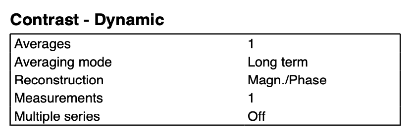

## About

dcm_qa_fmap is a simple DICOM to NIfTI validator script and dataset. This repository is similar to [dcm_qa](https://github.com/neurolabusc/dcm_qa), but converts direct fieldmaps. Fieldmaps can be used to undistort EPI sequences using [FSL's FUGUE](https://fsl.fmrib.ox.ac.uk/fsl/fslwiki/FUGUE/Guide#SIEMENS_data). Different scanner sequences can save fieldmapping data in different [forms](https://crnl.readthedocs.io/fieldmaps/index.html): magnitude and phase images, real and imaginary images, and direct field mapping where the scanner stores the direct estimated fieldmap (in Hz) as well as a magnitude image. Note that by adjusting the settings on a scanner console, one can store different forms of data. This repository provides direct fieldmaps from [Philips and GE scanners](https://github.com/bids-standard/bids-specification/pull/622). It also contains a script to convert these DICOM images to [BIDS-compatible](https://bids-specification--622.org.readthedocs.build/en/622/04-modality-specific-files/01-magnetic-resonance-imaging-data.html#case-3-direct-field-mapping) NIfTI images using dcm2niix (v1.0.20210410 and later).

## Data Sets

* GE/2_3db0maps s56_B0map simulated dataset
  * source: [Jaemin Shin, GE Medical](https://github.com/rordenlab/dcm2niix/issues/501)
  * (0019,109c): B0map
  * (0019,109e): B0map 
  * version: (0018,1020) 28\\LX\\MR29.1_EA_2036.a
  
* GE/3_3db0maps s57_3db0map simulated dataset
  * source: [Jaemin Shin, GE Medical](https://github.com/rordenlab/dcm2niix/issues/501)
  * (0019,109c): 3db0map
  * (0019,109e): EFGRE3D
  * version: (0018,1020) 28\\LX\\MR29.1_EA_2036.a

* GE/6_CV_Neuro s59_B0rf in-vivo brain dataset
  * source: [Jaemin Shin, GE Medical](https://github.com/rordenlab/dcm2niix/issues/501)
  * (0019,109c): B0rf
  * (0019,109e): B0map
  * version: (0018,1020) 27\\LX\\MR Software release:DV27.0_R01_1850.a
  
* Philips/fmap
  * source: [Baxter Rogers, Vanderbilt University](https://github.com/rordenlab/dcm2niix/issues/363)
  * Notes on [Philips fieldmap forms](https://github.com/rordenlab/dcm2niix/issues/455)
  * model: (0008,1090) Achieva dStream
  * version: (0018,1020) 5.3.0\5.3.0.3

* Siemens 
  * source: Chris Rorden of the [McCausland Center for Brain Imaging](https://www.mccauslandcenter.sc.edu/), Prisma fit VE11C
  * [CSA header](https://nipy.org/nibabel/dicom/siemens_csa.html) tag `tSequenceFileName` reports `%SiemensSeq%\\gre_field_mapping`
  * version: (0018,1020) syngo MR E11
  * Three Series were acquired. Reconstruction set to `Magnitude/Phase` results in two series (2,3) where the first includes the magnitude images for each echo time, and the second is the phase difference image. Note the latter includes [BIDS fields](https://github.com/rordenlab/dcm2niix/issues/139) `EchoTime1` and `EchoTime2` so you can determine the delta-TE for preprocessing. Another series (4) was acquired only an phase map was requested, and only the difference phase map is stored. The final series (5) was acquired with only magnitude reconstruction requested, and the result is two magnitude images, one for each echo. Note that for [FSL FUGUE](https://fsl.fmrib.ox.ac.uk/fsl/fslwiki/FUGUE) you will want to ensure reconstruction of **both** the phase and magnitude images.
  * Be aware that when both the magnitude and phase are reconstructed, the magnitude images use the identical DICOM image instance number (0020,0013) for each echo. You can see this in the file names which use the echo number and instance number, resulting in `e1_01.dcm`...`e1_36.dcm` and`e2_01.dcm`...`e2_36.dcm`. Unfortunately, many PACS systems will sort based on instance numbers and overwrite some images from the first echo with those from the second, leading to [data loss](https://neurostars.org/t/dcm2niix-node-nonzero-exit-code/1375/7). Note that the DICOM standard does not require that instance numbers are unique, so these images are technically legal. However, they are incompatible with the assumptions of many tools.
  * In brief, make sure your Siemens console is set up to Reconstruct **both Magnitude** (see image below for Siemens PDF) and make sure that all subsequent transfer and storage of these images does not delete magnitude images that share instance numbers.
  * 
 
## License

This software and images are open source and were acquired by National Institutes of Health. The the code is covered by the [2-clause BSD license](https://opensource.org/licenses/BSD-2-Clause).

## Versions

12-April-2021
 - Initial public release

16-July-2021
 - Siemens data

## Running

Assuming that the executable dcm2niix is in your path, you should be able to simply run the script `batch.sh` from the terminal.

If you have problems you can edit the first few lines of the `batch.sh` script so that `basedir` reports the explicit location of the `dcm_qa_fmap` folder (by default this is assumed to be the folder containing the script) on your computer and `exenam` reports the explicit location of dcm2niix (by default it is assumed to be in your path). Also, make sure the script is executable (`chmod +x batch.sh`). Then run the script.

## Useful Links

 - Notes for [Philips](https://github.com/rordenlab/dcm2niix/tree/master/Philips) DICOM images.
 - Notes for [GE](https://github.com/rordenlab/dcm2niix/tree/master/GE) DICOM images.
 - Notes on [GE fieldmaps](https://cni.stanford.edu/wiki/GE_Processing#Kendrick.27s_Notes_on_Fieldmaps).

